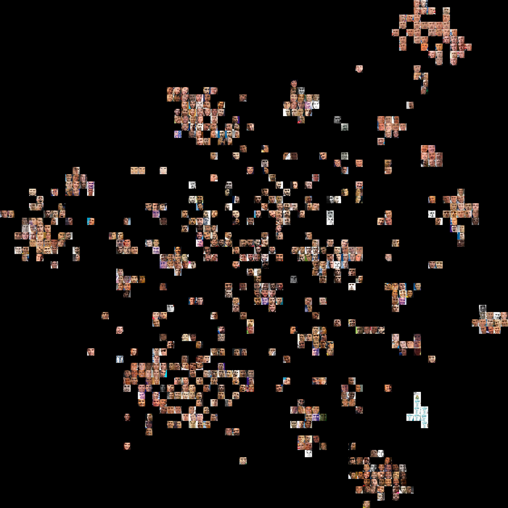
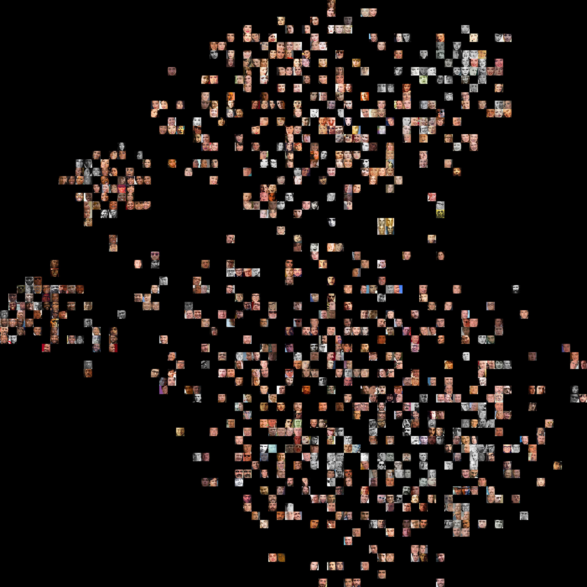
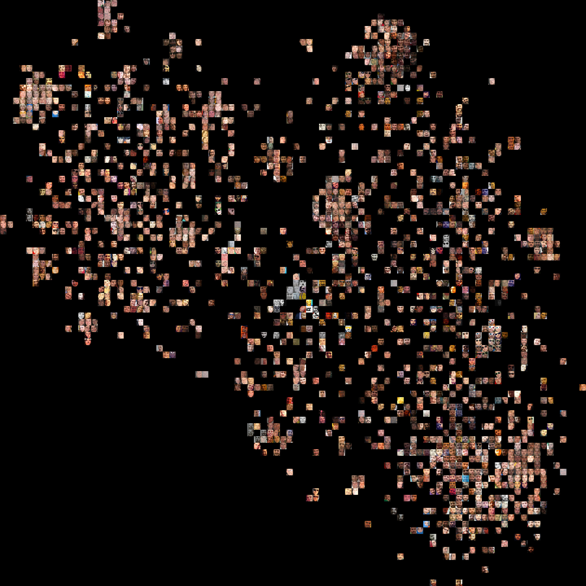
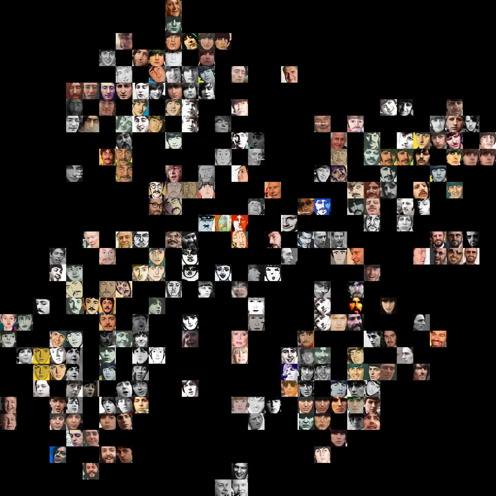

# Faces Map
This is a tool that generates an image representing a distribution of faces according to features computed by a convolutional neural network (CNN).

## How it works
1. Detect faces using [histogram of oriented gradients (HOG)](https://www.learnopencv.com/histogram-of-oriented-gradients/) or a [face-recognition CNN](http://blog.dlib.net/2017/02/high-quality-face-recognition-with-deep.html)
2. Extract 128 features from each face using a [face-encoding CNN](http://blog.dlib.net/2017/02/high-quality-face-recognition-with-deep.html)
3. Embed the 128D feature vectors into a 2D space using [t-Distributed Stochastic Neighbor Embedding (t-SNE)](https://lvdmaaten.github.io/tsne/)
4. Show faces at the corresponding 2D coordinates


## Examples

### [Real Madrid Club de Fútbol](logs/real_madrid.log)
```shell
log2map logs/real_madrid.log
```

* Each cluster corresponds to a different player
* The clusters of the president and the coaches, who are older than the players, are at the top-right
* The largest cluster is (of course...) for Cristiano Ronaldo




### [Oscars](logs/academy_awards.log)
```shell
log2map logs/academy_awards.log
```

* The algorithm put women on top and men at the bottom
* Black men and women have their own clusters at the left
* Children are between both
* The oscar statuette has its own in the cluster




### My Facebook photos
```shell
log2map myfacebook.log --faces-side 90 # not in the repo
```

* Again, there is a clear separation between men and women
* Asians have their own cluster, in the middle-top
* Closer friends have often larger clusters
* My cluster is the largest as the photos have been taken from my profile
* My cluster has different "neighbourhoods". Me without beard, me looking angry, me with glasses (subdivided into sunglasses, 3D glasses, round glasses)




### [The Beatles](logs/beatles.log)
```shell
log2map logs/beatles.log --faces-side 30
```

* The dataset is noisy, with many photos without faces or with drawn faces
* However the four clusters can be seen for John, Ringo, Paul and George
* Recent photos Paul and Ringo are slightly separated from their main clusters
* Most drawings are closer to the correct cluster




## Installation

Set up a new [`conda`](https://conda.io/) environment:

```shell
$ ENV_NAME="faces"
$ conda create -n $ENV_NAME python=3.6
$ source activate $ENV_NAME
```

Install `pip` package:

```shell
(faces) $ git clone https://github.com/fepegar/faces-map.git
(faces) $ pip install ./faces_map
```

### Optional (for experimental features)
```shell
(faces) $ conda install matplotlib
(faces) $ conda install vtk
```

## Usage
```shell
(faces) $ DIR_WITH_PHOTOS="awesome_photos/"
(faces) $ OUTPUT_CSV="encodings.csv"
(faces) $ OUTPUT_MAP="embedding.jpg"
(faces) $ encode_faces $DIR_WITH_PHOTOS $OUTPUT_CSV
(faces) $ embed_faces $OUTPUT_CSV $OUTPUT_MAP
```

If you want to use Facebook photos, you can download them as explained in the [`download_photos`](download_photos.py) script and use [`log2map`](log2map.py) to create the embedding directly. For example, running
```shell
(faces) $ log2map facebook.log
```
generates:

1. A photos directory `facebook/`
2. An encodings file `facebook.csv`
3. An embedding file `facebook.jpg`


## Acknowledgements
